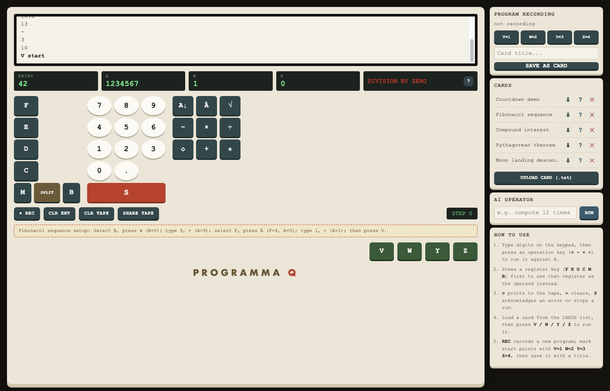

# Programma Q - A Programma 101 Emulator

A web-based emulator of the Olivetti Programma 101, the 1965 programmable desktop
calculator/proto-PC. Built on the official `arduino:web_ui`, `arduino:dbstorage_sqlstore`, and
`arduino:llm` Bricks, with keyboard-click sound effects on a physical Modulino Buzzer and the
Elea logo animating on the UNO Q's onboard LED matrix.



*A blocked `DIVISION BY ZERO` error, with the "?" button ready to ask the AI Assistant to explain
it in plain English, and the AI OPERATOR panel in the side column ready to take a natural-language
request and drive the keyboard itself. The register-setup hint above the start keys shows the key
sequence a loaded example card expects before it's run.*

## History

### The Programma 101

The Programma 101 (nicknamed "Perottina" after its lead engineer, Pier Giorgio Perotto) was
released by Olivetti in 1965 as a "desktop programmable calculator" -- there was no established
category for it yet, because nothing quite like it had shipped before. It had no operating system,
no general-purpose display, and no monitor: input came from a keyboard, output from a small
built-in printer, and the entire "program" for a task lived on a small magnetic card the size of a
credit card, which the machine could read back in and re-run. Despite that, it was Turing-complete,
programmable by ordinary (non-specialist) users, and small and cheap enough to sit on a desk rather
than fill a room -- qualities that later became defining traits of the personal computer, a
category the Programma 101 predates by roughly a decade.

It became famous in the United States for reasons Olivetti never advertised for: several were
purchased by NASA, and are reported to have been used by engineers to cross-check descent-trajectory
arithmetic for the Apollo 11 lunar module -- the same class of calculation modeled in this
emulator's bundled "Moon landing descent velocity" example card. The U.S. Air Force used them for
artillery calculations during the Vietnam War. Its industrial design -- by Mario Bellini, one of
the era's leading Italian designers -- later earned it a place in the permanent collection of New
York's Museum of Modern Art.

### Olivetti and Ivrea

Olivetti was headquartered in Ivrea, a small town in Italy's Piedmont region, where founder
Camillo Olivetti built the company's first typewriter factory in 1908. Under his son Adriano
Olivetti, the company became known as much for its design culture as for its engineering: Adriano
brought in outside architects, artists, and industrial designers (Bellini among them) and treated
product design, graphics, and even factory architecture as inseparable from the engineering itself
-- an approach still visible in Ivrea's Olivetti-era buildings, several of which are now a UNESCO
World Heritage Site ("Ivrea, Industrial City of the 20th Century"). The Elea 9000, the mainframe
computer line whose logo idles on this emulator's LED matrix, was designed under that same
philosophy: Ettore Sottsass styled its cabinets while Olivetti's engineers built the electronics,
the same engineering-plus-design pairing that produced the Programma 101 a few years later.

### The Arduino connection

Arduino's own origin traces back to the same town. In the early 2000s, Ivrea was home to the
Interaction Design Institute Ivrea (IDII), a design school set up in a former Olivetti facility
specifically because of the town's design heritage. Massimo Banzi was teaching there, and it's
where he and his collaborators (including David Cuartielles, David Mellis, Tom Igoe, and Gianluca
Martino) built the first Arduino boards in 2005 as a cheap, approachable tool for design students
with no electronics background to prototype interactive hardware -- a goal not far removed from
what made the Programma 101 novel in 1965: putting programmable computing within reach of people
who weren't computer specialists. This emulator, running the ghost of a 1965 Olivetti calculator
on a 2020s Arduino board, closes that loop in the same town's design lineage it started in.

## Running it

Deploy with the Arduino App CLI like any other app Brick bundle (`app.yaml` declares the
`arduino:web_ui`, `arduino:dbstorage_sqlstore`, and `arduino:llm` Bricks, and exposes port 7000).
Once deployed, open the app's URL (`http://<device-ip>:7000/`) in a browser to use it. Attach a
Modulino Buzzer to the paired MCU for keyboard-click, error, and printer-chatter sounds -- the app
runs fine without one, silently skipping the tones. The onboard LED matrix holds a static Elea logo
while idle and rapidly "rebuilds" it from blank to complete every time a calculation runs (a single
key press or a full program), degrading to no matrix updates the same way the buzzer does if the
MCU isn't attached. The AI Operator and Assistant (below) likewise degrade to disabled/unavailable
if the `arduino:llm` Brick isn't attached or fails to initialize.

## User guide

The panel mirrors the real machine's control layout: a scrolling tape strip along the top logs
every keystroke and printed result, register readouts below it show the entry buffer and the
live A, M, and R registers, and an error box lights up with a message whenever the machine
blocks on an error.

### Basic arithmetic (calculator mode)

The Programma 101 always computes against the **A** (accumulator) register. A typical calculation
looks like: type a number on the numeric keypad, press an operation key, type another number,
press another operation key, then press the print key to read the result off the tape.

1. **Type digits** on the numeric keypad (`0`-`9` and `.`) — they accumulate in the **entry
   buffer**, shown in the ENTRY readout. Nothing is committed to a register yet.
2. **Press an operation key** (`+`, `−`, `×`, `÷`, `√`, `A↓`, `Â`, `◇`, `✳`) to execute it
   immediately: with no register selected, the typed entry buffer is used as the operand against
   A; the entry buffer is then cleared.
3. **Select a register first** (optional) by pressing one of the register keys (`F`, `E`, `D`,
   `C`, `M`, `B`) — it highlights to show it's selected — then press an operation key to use that
   register's value as the operand instead of the entry buffer. Pressing the same register key
   again deselects it.
4. **`◇` (print)** writes the current value of A (or the selected register) to the tape.
5. **`✳` (clear)** zeroes out A (or the selected register).
6. **`S`** is Stop/Acknowledge: press it to clear a blocked error state (see below), or to halt a
   running program.

Example — add 7 and 3, then print the result: type `7`, press `+`, type `3`, press `+`, press
`◇`. The tape shows `+`, `+`, then `10`.

### Register keys and SPLIT

`F`, `E`, `D`, `C`, `M`, `B` select a register as the operand for the next operation key. **SPLIT**
splits or unsplits one of `B`, `C`, `D`, `E`, `F` into two independent half-capacity registers
(you'll be prompted for which register) — a feature of the real machine used by programs that
need two smaller values instead of one large one.

### Blocked/error states

Dividing by zero, taking the square root of a negative number, or overflowing a register's digit
capacity blocks the machine exactly as it did in 1965: the ERROR readout lights up with a
message and further operation keys are ignored until you press **S** to acknowledge and clear it.

### Recording and saving a program

1. Press **REC** to enter recording mode. Digit and operator key presses are now appended to an
   in-progress program instead of executing immediately — the STEP counter tracks how many
   instructions you've recorded.
2. Press one of **V=1 / W=2 / Y=3 / Z=4** at any point while recording to mark the *current* step
   as that label's entry point — this is what a later **V/W/Y/Z** start-key press will jump to.
3. Type a title into the **Card title** field and press **SAVE AS CARD** to commit the recorded
   program: it's saved to the CARDS list, loaded as the active program, and recording mode turns
   off.

### Running a saved program

Press one of the **V / W / Y / Z** start keys to run the loaded program from that key's label
until it hits a `stop` instruction, an error, or runs off the end. Every value the program prints
along the way appears on the tape.

**Loading a card only loads its instructions — not the register values its logic assumes.**
Exactly like the real magnetic cards, a saved program has no way to set its own starting values;
the operator keys them in by hand first. The moment you load a card that needs this (any of the
four bundled worked examples below), a **setup hint** appears above the start keys with the exact
key sequence to run before pressing V/W/Y/Z — e.g. loading "Fibonacci sequence" shows `Select B,
press ✳ (B=0); type 9, + (A=9); select F, press  (F=9, A=0); type 1, + (A=1); then press V.` A
card you record yourself has no hint, since you control its setup keys directly as part of the
program (or as manual key presses right before running it).

### Managing cards

The **CARDS** panel lists every saved card — click a title to load it as the active program, click
**⬇** to download it as a `.txt` file, or click **✕** to delete it. Click **UPLOAD CARD (.txt)** to
add a card from a `.txt` file on your computer — it's parsed and saved immediately, ready to load.
Uploaded and downloaded cards use the same plain-text format (a small header of `title:`/
`capacity:`/`labels:` lines, a `---` separator, then one instruction per line), so a card downloaded
from one device round-trips exactly when re-uploaded elsewhere. A demo countdown program and four
worked examples (see below) are seeded automatically on first run.

### How to use panel

Below the CARDS panel, the **HOW TO USE** box gives a quick on-screen refresher of the calculator
flow (type-then-operate, register selection, print/clear/stop, loading and running a card,
recording a new one) for anyone using the panel without this README open.

### Tape and entry controls

**CLR ENT** clears the typed-but-not-committed entry buffer without touching any register.
**CLR TAPE** clears the tape display. **SHARE TAPE** downloads the current tape's full contents
as a text file.

### AI Operator and Assistant

Two AI features run on the on-device `arduino:llm` Brick, and both disable themselves gracefully
(showing as unavailable) if that Brick isn't attached or fails to start:

- **AI Operator** (side panel) takes a natural-language request — e.g. "compute 12 times 7" —
  and drives it to completion by pressing real keys one at a time, exactly like a human operator
  would: it can only take the same actions available on the keyboard, so it can press a wrong key
  (recoverable, just like a human mistake) but it can never fabricate an answer that bypasses the
  emulator's real arithmetic. Type a request into the box and press **RUN**; the reply area below
  shows the full trace of keys it pressed and what happened after each one.
- **AI Assistant** ("?" buttons) explains things in plain English on demand: the "?" next to the
  error readout explains why the machine is currently blocked and what to try next, and the "?"
  next to each saved card in the CARDS list explains what that program computes and how.

## The bundled "Countdown demo" card

Every fresh install seeds one demo card, `Countdown demo`, matching the classic demo EMU101
itself ships. It implements a simple count-down-by-one loop:

| Step | Instruction | Effect |
|---|---|---|
| 0 (label `V`) | print A | Print the current value of A to the tape |
| 1 | subtract M from A | Decrement A by the value in M |
| 2 | conditional jump to label `Z` | If the last result went negative, jump to step 4 (stop) |
| 3 | jump to label `V` | Otherwise loop back to step 0 |
| 4 (label `Z`) | stop | Halt |

To run it from a clean start: type `1`, press `+` (A = 1), press `Â` with **M** selected (M = 1,
A = 0), type your starting number (e.g. `10`), press `+` (A = 10), load the "Countdown demo" card
from the CARDS panel if it isn't already loaded, and press **V**. The tape prints each value
counting down from your starting number to `0`, then one more decrement pushes A negative, the
conditional jump fires, and the program stops — leaving A at `-1` and M at `1`.

## Bundled example cards

Four worked examples are seeded alongside the countdown demo on first run, each with a full
key-by-key setup writeup in `docs/cards/`:

| Card | File | What it prints |
|---|---|---|
| Fibonacci sequence | `docs/cards/fibonacci_sequence.txt` | The first 10 Fibonacci terms: `1 1 2 3 5 8 13 21 34 55` |
| Compound interest | `docs/cards/compound_interest.txt` | A balance compounding yearly, e.g. $1000 at 5% for 5 years |
| Pythagorean theorem | `docs/cards/pythagorean_theorem.txt` | The hypotenuse `sqrt(a² + b²)` of a right triangle |
| Moon landing descent velocity | `docs/cards/moon_landing_descent_velocity.txt` | Lunar free-fall impact velocity `sqrt(2·g·h)`, g = 1.62 m/s² — the class of descent-trajectory arithmetic that made the Programma 101 famous when NASA engineers reportedly used one to help cross-check Apollo 11's lunar module descent |

Each `.txt` file gives the exact key sequence to set up its registers before pressing a start key,
the expected tape output, and a short explanation of how the program works. The same setup
sequence also appears in-app as a hint the moment the card is loaded (see "Running a saved program"
above).

## Architecture

Programma Q runs as two coordinated programs, both deployed and orchestrated together as a single
Arduino App:

- **The Linux side** (`python/`) runs the actual emulation, persistence, web server, and AI agents
  as one process, on the UNO Q's Linux MPU.
- **The MCU side** (`sketch/`) runs a small always-on sketch on the paired microcontroller, purely
  for the physical buzzer and LED matrix -- it has no knowledge of Programma 101 semantics at all.

```
Browser (Socket.IO) <-- state broadcasts --  arduino:web_ui Brick
        |  "key" events                              |
        v                                             v
   python/main.py  ---------------------------  python/engine/ (Machine, RegisterFile, cards)
        |     |                                        ^
        |     v                                        |
        |  python/cardstore.py -- arduino:dbstorage_sqlstore Brick (cards.db)
        |
        |  python/agents/{operator,assistant}.py -- arduino:llm Brick
        |        (tool calls dispatch back through main.py's own key handlers)
        |
        v  Bridge RPC (play_tone / set_matrix_mode)
   sketch/sketch.ino -- Modulino Buzzer + onboard LED matrix (MCU side)
```

- **Emulation core** (`python/engine/`). A clean-room reimplementation of the Programma 101's
  documented register model, instruction set, and card format — written from the real machine's
  published specifications, not derived from any existing emulator's source.
  - `registers.py` models the ten registers (M, A, R, B, C, D, E, F, p1, p2) as exact-decimal
    values via Python's `Decimal`, enforcing the real 22-digit (11-digit when split) capacity
    limits.
  - `instructions.py` defines the instruction vocabulary and start-key/label table.
  - `cpu.py`'s `Machine` executes one instruction at a time in either interactive (calculator)
    mode or full-program mode, raising the real machine's documented blocking conditions (division
    by zero, negative square root, overflow) the same way the original halts and waits for the
    operator to press S.
  - `cards.py` defines `ProgramCard` (title + instructions + label table), the five bundled cards'
    factories, the plain-text `.txt` round-trip format used by upload/download, and
    `SETUP_HINTS` — the one-line register-setup reminder shown in the UI for cards whose logic
    assumes values it can't set itself.
  - `printer.py` formats tape lines (printed values and echoed key presses).
- **Persistence** (`python/cardstore.py`). Wraps the `arduino:dbstorage_sqlstore` Brick to
  save/load/delete named program cards, with every query touching a user-supplied title going
  through bound parameters (`execute_sql` with `?` placeholders) rather than a raw condition
  string.
- **Orchestrator** (`python/main.py`). Wires the emulation core to the `arduino:web_ui` Brick.
  Every key press synchronously advances the `Machine` by one step and the server always answers
  with a full state broadcast (see the module's own docstring for the exact Socket.IO "key"
  message protocol). A single `_state_lock` guards every read/mutation of machine/tape/record
  state, since the AI Operator drives key presses from a background thread while a human can be
  clicking keys on the same socket at the same time.
- **Web UI** (`assets/`). A click-driven skeuomorphic control panel served by the `arduino:web_ui`
  Brick over Socket.IO — every key is a real click target sending a small JSON payload; the server
  always answers with a full state broadcast (tape, registers, entry buffer, recording state, card
  list, loaded-card setup hint).
- **Sound** (`sketch/` + `python/hw.py`). The sketch drives a physical Modulino Buzzer via a
  single `play_tone(freq, ms)` Bridge RPC; `hw.py` calls it for keyboard clicks, errors, and
  printer chatter, degrading to silent UI-only operation if no buzzer/MCU is attached.
- **LED matrix** (`sketch/` + `python/hw.py`). The same sketch also drives the UNO Q's onboard LED
  matrix via a single `set_matrix_mode(mode)` Bridge RPC, mirroring conquest-q's approach: the MCU
  renders the current mode as a pure function of `millis()`, so the animation never blocks on or
  waits for the Linux side. At rest the matrix holds a static 8x13 rendering of the Elea 9000 logo;
  every calculation — a single key press via `hw.pulse_calculating()`, or a full program run
  bracketed by `hw.show_calculating()`/`hw.show_idle()` — retriggers a ~350ms "rebuild" reveal that
  redraws the logo pixel-by-pixel from blank to complete, and a program still running once the
  rebuild finishes holds a slow checkerboard "breathing" pulse until it's done.
- **AI agents** (`python/agents/`). `operator.py` and `assistant.py` both run on the on-device
  `arduino:llm` Brick. The AI Operator's tool-calling functions dispatch through the exact same
  validated key-press handlers `main.py` exposes to a human's browser clicks, so the LLM is never
  in the calculation path — it can only press a (recoverable) wrong key, never produce a wrong
  answer that bypasses `engine.cpu.Machine`'s real checks; since the Brick's tool-calling invokes
  at most one tool per call, `OperatorAgent.run()` drives its own multi-step call/observe loop. The
  Assistant is purely explanatory (plain chat, no tools) and never mutates machine/tape/card state.
  Both run on background threads guarded by `main.py`'s `_state_lock`, replying over a separate
  `"ai_reply"` broadcast so they don't block a human still clicking keys on the same session.

## License

This project is licensed under the [Mozilla Public License 2.0](LICENSE). All original source
(`python/`, `sketch/`, `assets/index.html`, `assets/app.js`, `assets/style.css`) is a clean-room
implementation written from the Programma 101's public documentation, carries an MPL-2.0 SPDX
header, and is licensed under MPL-2.0. The one vendored third-party file, `assets/socket.io.min.js`
(Socket.IO, © Guillermo Rauch), is separately licensed under the MIT License and retains its own
license notice, which is permissive and compatible with MPL-2.0.
